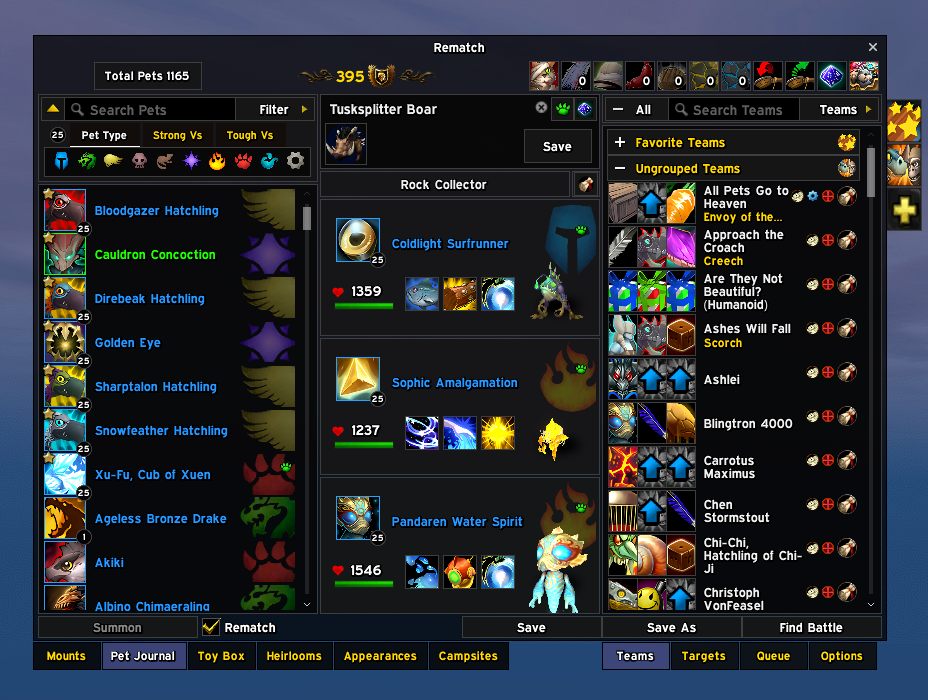
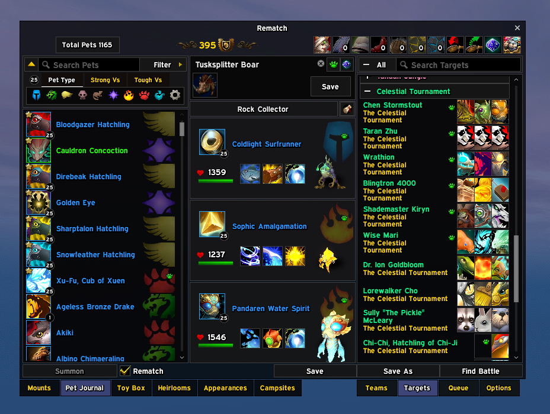
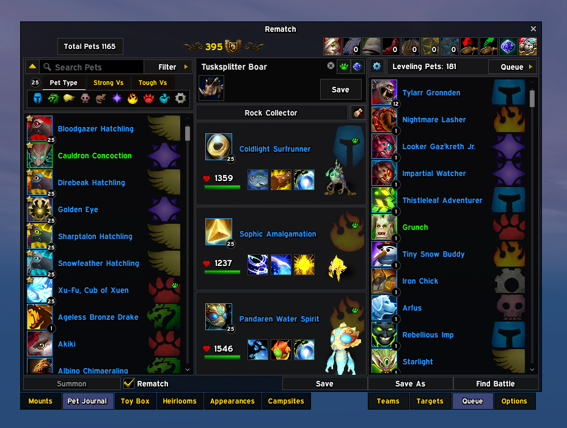
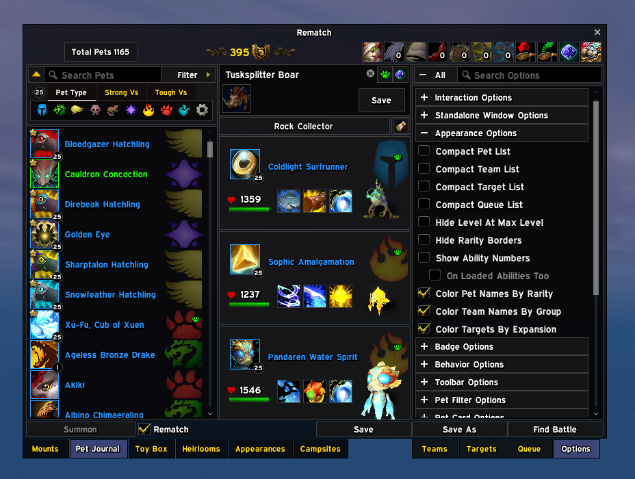

# Rematch EllesmereUI Skin

Reskins [Rematch](https://www.curseforge.com/wow/addons/rematch) to match
[EllesmereUI](https://github.com/EllesmereGaming/EllesmereUI), and fixes the
blank Rematch window in patch 12.1 while it's at it.

You need both addons installed. This one contains no part of either, and if
you're not running both it quietly does nothing.

The whole idea is that it follows *your* EllesmereUI setup rather than imposing a
look of its own. Window colour, transparency, accent, font and border all come
from your active profile, read fresh each time. Change something in EllesmereUI
and Rematch changes with it. Both of Rematch's homes are covered: its own
standalone window, and the Pet Journal seat inside the Collections window.

## Screenshots

<table>
  <tr>
    <td width="50%" valign="top"></td>
    <td width="50%" valign="top"></td>
  </tr>
  <tr>
    <td valign="top">Teams in the Pet Journal on a Dark Mode profile, colour and transparency both from it. Rematch's own tabs sit level with the Collections tabs beside them</td>
    <td valign="top">Targets, grouped by expansion, each trainer with the pets they bring</td>
  </tr>
  <tr>
    <td valign="top"></td>
    <td valign="top"></td>
  </tr>
  <tr>
    <td valign="top">The leveling queue, with each pet's level in a badge on the corner of its icon</td>
    <td valign="top">Rematch's own options, skinned to match, with checkmarks in your accent colour</td>
  </tr>
</table>

## Goes well with

- **[MountsJournal EllesmereUI Skin](https://github.com/egsherlock/MountsJournal-EllesmereUI-Skin)**
  is this same skin for MountsJournal, the mount tab one over, built on the
  same foundation so the two Collections tabs match each other as well as
  the rest of your UI.
- Or try my other addon, **[Postbox](https://github.com/egsherlock/Postbox)**,
  a full mailbox replacement: clear a full inbox in one click or just the
  mail you choose, complete recipients as you type, and see what is waiting
  without visiting a mailbox. It wears your EllesmereUI or ElvUI look.

## The 12.1 blank window

Patch 12.1 removed a small API Rematch relies on, and Rematch's author has not
yet shipped an update, so the journal comes up as an empty window. This skin
restores that API itself, the same fix the standalone
[FixRematch](https://www.curseforge.com/wow/addons/fixrematch) addon provides,
so you don't need a second addon for it. If you already have FixRematch
installed the two get along fine, and once Rematch or the game supplies the
API again the fix steps aside on its own.

There is a second cause that FixRematch does not cover: inside dungeons,
delves and other instanced content the game hides creature names from addons,
and Rematch stops dead on the first one it tries to show, which blanks the
window in the same way. This skin guards that lookup too. While you are inside
an instance those names read "Unknown (npc id …)", and they come back normally
once you leave. `/rmeuiskin` reports how many names were hidden this session.

## Installing

Drop the folder into `World of Warcraft/_retail_/Interface/AddOns/`, or grab it
from the [releases page](../../releases) with your addon manager.

## What it takes from EllesmereUI

Nothing is hardcoded, and no profile gets special treatment. Imports like
atrocityUI or AES work simply because they write these same values.

| Look | Where it comes from |
|---|---|
| Window colour and transparency | `EllesmereUI.GetDarkModeFill()`, your profile's Dark Mode fill, colour and alpha both |
| Accent (selected tabs, checkmarks, sliders, selection borders) | `EllesmereUI.ELLESMERE_GREEN` |
| UI font | `EllesmereUI.GetFontPath("blizzardSkin")` |
| Window border | `EllesmereUIDB.windowBorderTexture` and `windowBorderSize`, including a size of 0 meaning no border |
| Window style | `EllesmereUI.GetBlizzWindowStyle("collections")` |

These get re-read every time something is painted, never cached. Switch profile,
reopen Rematch, done. There's nothing to import or keep in sync.

## Options

**Game Menu > Options > AddOns > Rematch EllesmereUI Skin**

| Setting | Default | What it does |
|---|---|---|
| Window backdrop | EllesmereUI Dark Mode | Uses your Dark Mode colour and alpha. The other choice, Blizzard window art, uses EllesmereUI's own window texture, which is fully opaque and can't be made see through. |
| Follow EllesmereUI opacity | on | Uses your Dark Mode alpha. Turn it off if you'd rather set the transparency yourself. |
| Opacity | 90 | Your own transparency setting. Ignored while the option above is on. |
| Window edge | Thin dark line | A crisp 1px edge. The alternative, EllesmereUI window frame, matches its windows exactly but brings a soft inner shading with it. |
| Border style | Follow EllesmereUI | Whatever border you've set in EllesmereUI's own options, texture and size. You can also pick one yourself from its border list, including Glow, Shadow and any LibSharedMedia borders. |
| Border size | 2 | Thickness, 1 to 4. Ignored while following EllesmereUI. |

## What it actually touches

**Rematch's own frames**, all over: the main window and its title bar, toolbar,
bottom bar, panel tabs and team tabs; the pets, teams, targets, queue and
options panels with their lists, headers, search boxes and filters; the loadout
panels and ability buttons; the pet card, notes card and ability tooltips; the
dialogs; the menus; and the tooltips. Art is only ever faded, never hidden.
Nothing is reparented or has its scripts replaced, and every hook is a
`HookScript` or `hooksecurefunc`. Two things are redrawn rather than faded:
pet levels sit in a small round badge on the icon's corner, and in journal
mode Rematch's own tabs are dressed to match the Collections tabs beside
them, whichever addon is drawing that row (stock Blizzard, EllesmereUI, or
atrocityEssentials).

**Blizzard's Collections frame**, in one specific way. In journal mode Rematch
sits inside Collections, so its chrome is faded while Rematch is open and put
back when it closes. Without this it would show through a transparent
backdrop. Only regions are touched, never frames, and only the parts that
actually overlap the window. The Collections tab row underneath is left alone.

Cost is a one off pass at login plus hooks. There's no `OnUpdate`, no polling and
no per frame work, and the internal registries use weak keys so recycled list
rows can still be collected.

## If something looks wrong

`/rmeuiskin` tells you what actually ran: which backend is live, the versions
installed, whether the 12.1 fix was needed, the colours and border it resolved,
and any stage that failed along with the Lua error. Each section is isolated, so
if a frame moves in a Rematch update you lose that section rather than the
whole window.

`/rmeuiskin behind` lists anything still drawing behind the window in journal
mode, biggest first. `/rmeuiskin tabs` compares Rematch's panel tabs against
Collections' own row beside them. Both print what the frames really carry,
texture, size, colour and alpha, which is usually the fastest way to tell a bug
here apart from a Blizzard or EllesmereUI change. If something looks like it
moved, run `tabs` before and after and compare the two.

## Compatibility

Written against Rematch 5.3.1 and EllesmereUI 9.1.8. Works on EllesmereUI 8.6.6
and newer: on 8.6.8+ with the Blizzard Skin child addon running it registers
through the official skinning API and shows up under Blizzard Window Skins >
Third-Party Addons; without it the same primitives are rebuilt from the public
helpers EllesmereUI exports. The window shell, scroll bars and checkboxes are
always drawn by this addon itself, so the look is identical either way. You
don't need to do anything, and `/rmeuiskin` will tell you which backend is
running.

## Licence

GPLv3. The skinning facade and most of the helpers come from
[MountsJournal EllesmereUI Skin](https://github.com/egsherlock/MountsJournal-EllesmereUI-Skin),
the same author's earlier skin. The MouseIsOver fix is the same one-line
function the standalone
[FixRematch](https://www.curseforge.com/wow/addons/fixrematch) (unieagle, MIT)
ships: both put back Blizzard's own removed line, and FixRematch found it
first. The old
[Rematch ElvUI Skin](https://github.com/nihilistzsche/RematchElvUISkin) by
Gello and nihilistzsche was the checklist of what a Rematch skin has to reach.
Thanks to Gello for Rematch and to EllesmereGaming for EllesmereUI.

Unofficial, and not affiliated with any of those projects.
